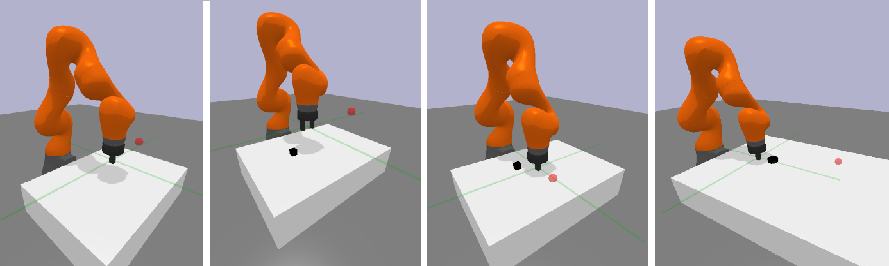

### Pybullet-implementation of the multi-goal robotics environment originally from Open AI Gym.

This version uses a kuka iiwa14 7DoF arm, equipped with a robotiq85 two finger gripper or a simple parallel jaw.

The basic four tasks are basically the same as the ones in the OpenAI Gym: **Reach, Push, Pick and Place, Slide**.
However, it may look funny when the robot picks up a block with the robotiq85 gripper,
since it's under-actuated and thus makes it hard to fine-tune the simulation. 
You can use the parallel jaw gripper, which is effectively the same as the OpenAI one.

I have implemented some goal-conditioned RL algos in my another repo, using the 
original Gym environment. There are DDPG-HER, SAC-HER, and others.
<a href="https://github.com/IanYangChina/DRL_Implementation.git" target="_blank">DRL_Implementation.</a>
Expired mujoco license got me here. I will also retrain those agents and pose performance ASAP.

This package also provides some harder tasks for long-horizon sparse reward robotic arm manipulation tasks
on this package as well. All the environments have been summarised in a [paper](https://arxiv.org/abs/2105.05985).
There are still on-going updates for this package.

### Installation

```
git clone https://github.com/IanYangChina/pybullet_multigoal_gym.git
cd pybullet_multigoal_gym
pip install -r requirements.txt
pip install .
```

### Some info

Observation, state, action, goal and reward are all setup to be the same as the original environment.

Observation is a dictionary, containing the state, desired goal and achieved goal.

Since no rotation is involved, states contain the end-effector Cartesian position, 
linear and angular velocities; and block Cartesian position, linear and angular velocities 
(if the task involves a block).

Goals are either EE or block Cartesian positions, in the world frame.

Actions are 3 dimensional for the Reach, Push and Slide tasks, which are xyz movements in the 
EE space. For the Pick and Place task, there is an extra dimension related to the closing and opening
of the gripper fingers. All of them are within [-1, 1].

Rewards are set to negatively proportional to the goal distance. For sparse, 
it's -1 and 0 rewards, where 0 stands for goal being achieved. For dense reward,
it equals to the negative goal distance (achieved & desired goals).

Use the `make_env(...)` method to make your environments. Due to backend differences, the `render()` method 
should not need to be called by users. 
To run experiment headless, make environment with `render=False`. 
To run experiment with image observations, make environment with `image_observation=True`. 
Only the Reach, PickAndPlace and Push envs support image observation. Users can define their
own camera for observation and goal images. The camera id `-1` stands for a on-hand camera. 
See examples below.

### Try it out

```python
# Single-stage manipulation environments
# Reach, Push, PickAndPlace, Slide
import pybullet_multigoal_gym as pmg
# Install matplotlib if you want to use imshow to view the goal images
import matplotlib.pyplot as plt

camera_setup = [
    {
        'cameraEyePosition': [-1.0, 0.25, 0.6],
        'cameraTargetPosition': [-0.6, 0.05, 0.2],
        'cameraUpVector': [0, 0, 1],
        'render_width': 128,
        'render_height': 128
    },
    {
        'cameraEyePosition': [-1.0, -0.25, 0.6],
        'cameraTargetPosition': [-0.6, -0.05, 0.2],
        'cameraUpVector': [0, 0, 1],
        'render_width': 128,
        'render_height': 128
    }
]

env = pmg.make_env(
    # task args ['reach', 'push', 'slide', 'pick_and_place', 
    #            'block_stack', 'block_rearrange', 'chest_pick_and_place', 'chest_push']
    task='block_rearrange',
    gripper='parallel_jaw',
    num_block=4,  # only meaningful for multi-block tasks
    render=False,
    binary_reward=True,
    max_episode_steps=5,
    # image observation args
    image_observation=True,
    depth_image=False,
    goal_image=True,
    visualize_target=True,
    camera_setup=camera_setup,
    observation_cam_id=0,
    goal_cam_id=1,
    # curriculum args
    use_curriculum=True,
    num_goals_to_generate=90)

obs = env.reset()
t = 0
while True:
    t += 1
    action = env.action_space.sample()
    obs, reward, done, info = env.step(action)
    print('state: ', obs['state'], '\n',
          'desired_goal: ', obs['desired_goal'], '\n',
          'achieved_goal: ', obs['achieved_goal'], '\n',
          'reward: ', reward, '\n')
    plt.imshow(obs['observation'])
    plt.pause(0.00001)      
    if done:
        env.reset()
```

### Scenes




### Updates

2020.12.26 --- Add hierarchical environments for a pick and place task, with image observation and goal supported. 
See the above example.

2020.12.28 --- Add image observation to non-hierarchical environments.

2021.01.14 --- Add parallel jaw gripper.

2021.03.08 --- Add a make_env(...) method to replace the pre-registration codes.

2021.03.09 --- Add multi-block stacking and re-arranging tasks

2021.03.12 --- Add multi-block tasks with a chest

2021.03.17 --- Joint space control support

2021.03.18 --- Finish curriculum; add on-hand camera observation
